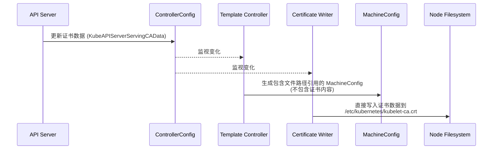

# kubelet-ca.crt 更新机制分析

## 问题背景

当 `/etc/kubernetes/kubelet-ca.crt` 更新后，为什么不会创建一个新的 machine config？

## 核心发现

通过对 Machine Config Operator (MCO) 源代码的深入分析，我发现虽然模板确实会监视 ControllerConfig 的变化，但 kubelet-ca.crt 文件的更新不会触发新的 Machine Config 生成。这是由于证书更新的特殊处理机制。

## 证书更新机制详解

### 1. 证书数据与模板分离

- kubelet.yaml 模板中引用了 `/etc/kubernetes/kubelet-ca.crt` 文件路径
- 但模板中并不包含实际的证书数据，只包含文件路径引用
- 实际的证书数据存储在 ControllerConfig 的 `KubeAPIServerServingCAData` 字段中

### 2. 双路径处理机制

MCO 采用了双路径机制来处理证书更新：



- **模板控制器路径**：模板控制器 (template_controller.go) 确实监视 ControllerConfig 的变化，但它生成的 MachineConfig 只包含对证书文件的引用，不包含证书内容
- **证书写入路径**：证书写入器 (certificate_writer.go) 也监视 ControllerConfig 的变化，但它直接将证书数据写入文件系统，绕过 MachineConfig 生成过程

### 3. 证书处理的关键代码

在 `certificate_writer.go` 中，证书数据直接从 ControllerConfig 提取并写入文件系统：

```go
if currentNodeControllerConfigResource != controllerConfig.ObjectMeta.ResourceVersion || controllerConfig.Annotations[ctrlcommon.ServiceCARotateAnnotation] == ctrlcommon.ServiceCARotateTrue {
    pathToData := make(map[string][]byte)
    kubeAPIServerServingCABytes := controllerConfig.Spec.KubeAPIServerServingCAData
    cloudCA := controllerConfig.Spec.CloudProviderCAData
    pathToData[caBundleFilePath] = kubeAPIServerServingCABytes // /etc/kubernetes/kubelet-ca.crt
    pathToData[cloudCABundleFilePath] = cloudCA
    
    if err := writeToDisk(pathToData); err != nil {
        return err
    }
}
```

而在模板文件 `kubelet.yaml` 中，只包含对证书文件的引用，不包含证书内容：

```yaml
authentication:
  x509:
    clientCAFile: /etc/kubernetes/kubelet-ca.crt
```

### 4. 证书更新的日志证据

从日志中可以看到证书同步的过程：

```
I0410 15:59:14.239434   31662 certificate_writer.go:303] Certificate was synced from controllerconfig resourceVersion 23344
I0410 15:59:15.621037   31662 certificate_writer.go:303] Certificate was synced from controllerconfig resourceVersion 23346
```

kubelet 检测到证书文件的变化并加载新的 CA 包：

```
I0410 12:48:19.585727    2479 dynamic_cafile_content.go:119] "Loaded a new CA Bundle and Verifier" name="client-ca-bundle::/etc/kubernetes/kubelet-ca.crt"
```

## 设计优势

这种设计有几个关键优势：

1. **避免不必要的节点重启**：证书轮换是一个常规操作，如果每次证书更新都生成新的 MachineConfig，将导致节点频繁重启，影响集群可用性

2. **分离关注点**：
   - MachineConfig 负责定义节点配置结构（如 kubelet 配置文件中引用证书的路径）
   - 证书写入器负责管理证书内容的更新，无需修改配置结构

3. **实时证书更新**：证书可以实时更新而不需要重新配置和重启节点上的服务

## 特殊情况：服务 CA 轮换

在某些情况下，证书更新可能需要重启 kubelet 服务，但仍然不需要生成新的 MachineConfig：

```go
if controllerConfig.Annotations[ctrlcommon.ServiceCARotateAnnotation] == ctrlcommon.ServiceCARotateTrue && oldAnno != controllerConfig.Annotations[ctrlcommon.ServiceCARotateAnnotation] && cmErr == nil && kubeConfigDiff && !allCertsThere && !dn.deferKubeletRestart {
    // ... [重启 kubelet 的代码]
    logSystem("restarting kubelet due to server-ca rotation")
    if err := runCmdSync("systemctl", "stop", "kubelet"); err != nil {
        return err
    }
    // ... [更多代码]
}
```

## 结论

虽然模板控制器确实监视 ControllerConfig 的变化，但对于证书数据，OpenShift 采用了特殊的处理机制：证书内容的更新由证书写入器直接处理，而不是通过生成新的 MachineConfig。这种设计允许证书轮换不会触发节点重启，提高了集群的稳定性和可用性。
