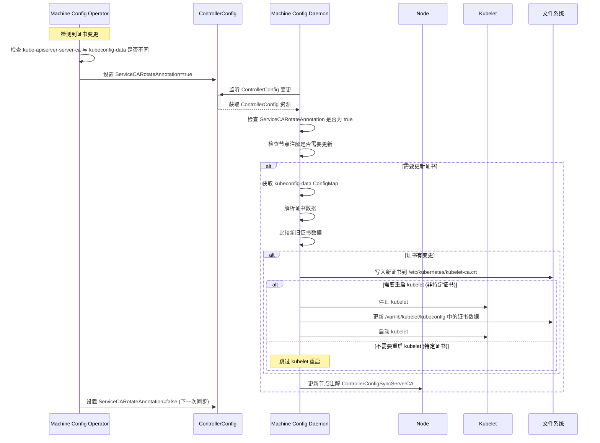

# ServiceCARotateAnnotation 控制 kubelet-ca.crt 更新机制分析

## 概述

`ServiceCARotateAnnotation` 是一个关键变量，它控制了 `/etc/kubernetes/kubelet-ca.crt` 证书的更新过程，并且能够在不触发创建新的 machine config 的情况下完成证书更新。这种机制允许系统在证书轮换时避免不必要的节点重启，提高了集群的可用性。

## 关键代码分析

### 1. ServiceCARotateAnnotation 定义

在 `pkg/controller/common/constants.go` 中定义：

```go
ServiceCARotateAnnotation = "machineconfiguration.openshift.io/service-ca-rotate"
ServiceCARotateTrue = "true"
ServiceCARotateFalse = "false"
```

### 2. 证书轮换触发机制

在 `pkg/operator/sync.go` 中，MCO 会检测 kube-apiserver-server-ca 配置映射中的证书数据是否发生变化：

```go
if !bytes.Equal(data, dataOld) && getErr == nil {
    klog.Infof("the MCO configmap for the server-ca and the openshift-config-managed one do not match...")
    // 更新 kubeconfig-data ConfigMap
    // ...
    editCCAnno = true
}

// 设置 ServiceCARotateAnnotation 注解
if editCCAnno {
    cc.Annotations[ctrlcommon.ServiceCARotateAnnotation] = ctrlcommon.ServiceCARotateTrue
} else {
    cc.Annotations[ctrlcommon.ServiceCARotateAnnotation] = ctrlcommon.ServiceCARotateFalse
}
```

### 3. 证书更新处理逻辑

在 `pkg/daemon/certificate_writer.go` 中，MCD 会检测 ControllerConfig 中的 `ServiceCARotateAnnotation` 注解：

```go
if controllerConfig.Annotations[ctrlcommon.ServiceCARotateAnnotation] == ctrlcommon.ServiceCARotateTrue && 
   dn.node.Annotations[constants.ControllerConfigSyncServerCA] != controllerConfig.Annotations[ctrlcommon.ServiceCARotateAnnotation] {
    // 获取新的证书数据
    cm, cmErr = dn.kubeClient.CoreV1().ConfigMaps("openshift-machine-config-operator").Get(context.TODO(), "kubeconfig-data", v1.GetOptions{})
    // ...
}
```

当检测到证书需要更新时，MCD 会：
1. 从 `kubeconfig-data` ConfigMap 获取新的证书数据
2. 比较新旧证书数据，确定是否需要更新
3. 将新证书写入 `/etc/kubernetes/kubelet-ca.crt`
4. 更新节点注解以记录证书已更新

### 4. 特殊处理：避免不必要的 kubelet 重启

MCD 会检查证书变更的类型，特别是对于某些特定的证书，会避免重启 kubelet：

```go
// 这些证书在升级过程中随机轮换，需要忽略，不重启 kubelet
if !strings.Contains(c.Subject.CommonName, "kube-apiserver-localhost-signer") && 
   !strings.Contains(c.Subject.CommonName, "openshift-kube-apiserver-operator_localhost-recovery-serving-signer") && 
   !strings.Contains(c.Subject.CommonName, "kube-apiserver-lb-signer") {
    logSystem("Need to restart kubelet")
    dn.deferKubeletRestart = false
} else {
    logSystem("Skipping kubelet restart")
}
```

### 5. 证书更新后的处理

当证书更新完成后，MCD 会更新节点注解，记录已同步的证书版本：

```go
if dn.node.Annotations[constants.ControllerConfigSyncServerCA] != controllerConfig.Annotations[ctrlcommon.ServiceCARotateAnnotation] {
    annos[constants.ControllerConfigSyncServerCA] = controllerConfig.Annotations[ctrlcommon.ServiceCARotateAnnotation]
}
```

## 证书更新流程时序图



## 关键发现

1. **避免节点重启**：通过 `ServiceCARotateAnnotation` 机制，系统能够在不创建新 MachineConfig 的情况下更新证书，避免了节点重启。

2. **选择性 kubelet 重启**：系统会根据证书类型决定是否需要重启 kubelet。对于某些特定的证书（如 `kube-apiserver-localhost-signer`），系统会跳过 kubelet 重启。

3. **状态追踪**：通过节点注解 `ControllerConfigSyncServerCA`，系统能够追踪每个节点的证书更新状态，确保证书正确同步。

4. **证书合并**：在 `mergeCertWithCABundle` 函数中，系统会将新证书与现有证书捆绑合并，确保证书链的完整性。

5. **安全性保障**：即使在证书轮换过程中，系统也能保持 API 服务器与 kubelet 之间的安全通信，不会中断集群操作。

这种机制显著提高了 OpenShift 集群在证书轮换过程中的可用性，减少了维护窗口的需求，同时保持了集群的安全性。
