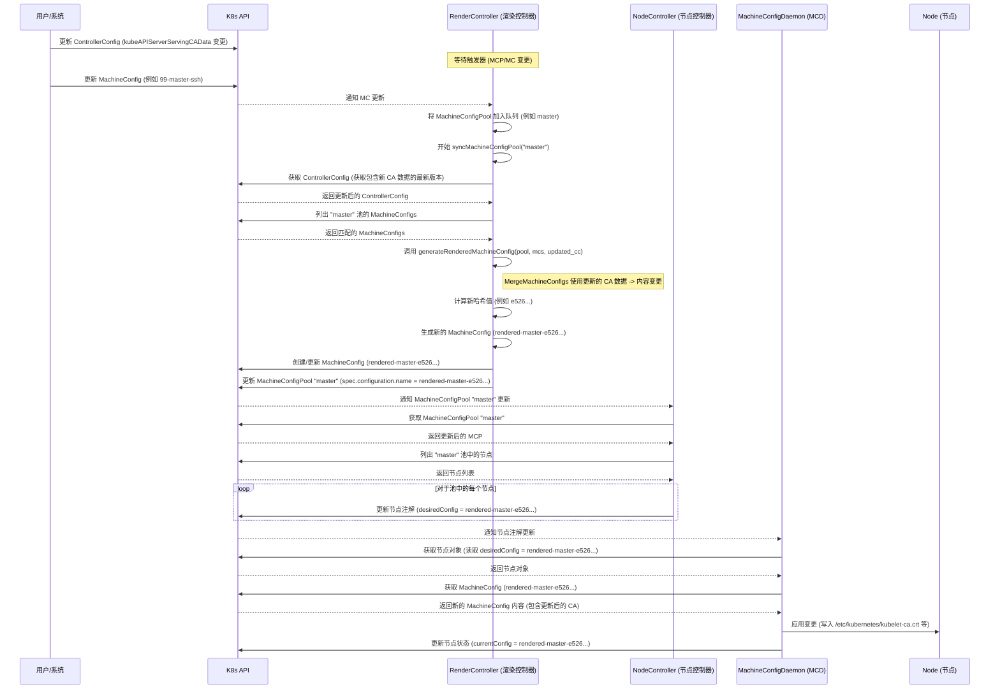

# ControllerConfig 中 kubeAPIServerServingCAData 变更触发 Machine Config Render 的分析报告

## 总结

修改 `ControllerConfig` 对象中的 `kubeAPIServerServingCAData` 字段本身并**不会**直接触发 Render Controller (渲染控制器)。相反，这个变更会在相关 `MachineConfigPool` 的**下一次计划同步**中被获取（该同步由池本身或其关联的 `MachineConfig` 资源的变更触发）。

在同步过程中，Render Controller 会获取**最新**的 `ControllerConfig`，将更新后的 CA 数据合并到配置中。如果合并后的内容发生变化，会生成一个新的带有新哈希值的 Rendered `MachineConfig`，并更新 `MachineConfigPool` 指向这个新配置。这个池的更新随后会触发 Node Controller 和 Machine Config Daemon (MCD)，将包含更新后 CA 数据的新配置应用到节点上。

## 代码分析 (`pkg/controller/render/render_controller.go`)

1.  **不直接监听 ControllerConfig:** Render Controller 仅为 `MachineConfigPool` 和 `MachineConfig` 对象设置事件处理器，并未直接监听 `ControllerConfig` 的变化。
    ```go
    // 在 New 函数中：仅为 MCP 和 MC informer 设置事件处理器
    mcpInformer.Informer().AddEventHandler(cache.ResourceEventHandlerFuncs{
        AddFunc:    ctrl.addMachineConfigPool,
        UpdateFunc: ctrl.updateMachineConfigPool,
        DeleteFunc: ctrl.deleteMachineConfigPool,
    })
    mcInformer.Informer().AddEventHandler(cache.ResourceEventHandlerFuncs{
        AddFunc:    ctrl.addMachineConfig,
        UpdateFunc: ctrl.updateMachineConfig,
        DeleteFunc: ctrl.deleteMachineConfig,
    })
    // 没有专门针对 ccInformer 更新来触发 ctrl.queue.Add() 的处理器
    ```

2.  **同步期间获取最新的 ControllerConfig:** 当 `syncMachineConfigPool` 函数被触发时（由池或配置变更引起），它会使用 lister (`ctrl.ccLister.Get`) 获取当前的 `ControllerConfig`。
    ```go
    // 在 syncGeneratedMachineConfig 函数内部（由 syncMachineConfigPool 调用）
    func (ctrl *Controller) syncGeneratedMachineConfig(pool *mcfgv1.MachineConfigPool, configs []*mcfgv1.MachineConfig) error {
        // ...省略的代码...
        // 获取 ControllerConfig 以传递给 generateRenderedMachineConfig
        cc, err := ctrl.ccLister.Get(ctrlcommon.ControllerConfigName)
        if err != nil {
            return err
        }

        generated, err := generateRenderedMachineConfig(pool, configs, cc) // 在这里传递 ControllerConfig
        // ...省略的代码...
    }
    ```

3.  **在渲染中使用 ControllerConfig:** 获取到的 `ControllerConfig` (`cc`) 被传递给 `generateRenderedMachineConfig` 函数，该函数又将其传递给 `ctrlcommon.MergeMachineConfigs`。这个合并函数使用 `ControllerConfig` 中的字段（包括 `kubeAPIServerServingCAData`）来创建最终合并的配置内容。
    ```go
    // 在 generateRenderedMachineConfig 函数内部
    func generateRenderedMachineConfig(pool *mcfgv1.MachineConfigPool, configs []*mcfgv1.MachineConfig, cconfig *mcfgv1.ControllerConfig) (*mcfgv1.MachineConfig, error) {
        // ...省略的验证代码...

        // MergeMachineConfigs 使用 ControllerConfig 数据
        merged, err := ctrlcommon.MergeMachineConfigs(configs, cconfig)
        // ...省略的代码...
        return merged, nil
    }
    ```
    如果 `kubeAPIServerServingCAData` 发生了变化，`MergeMachineConfigs` 的输出将会不同，从而导致生成新的哈希值和新的 Rendered `MachineConfig`。

## 日志分析 (`wzh.evid/mco.log` - Machine Config Daemon 日志)

提供的 MCD 日志显示了节点应用由 `ControllerConfig` 变更所导致的配置更新的过程：

1.  **检测到新配置:** MCD 检测到期望配置发生变化，从旧哈希 (`846b...`) 转换到新哈希 (`e526...`)。
    ```log
    I0410 14:23:23.081875    4014 update.go:542] Checking Reconcilable for config rendered-master-846b... to rendered-master-e526...
    I0410 14:23:23.135821    4014 update.go:2118] Starting update from rendered-master-846b... to rendered-master-e526...
    ```
    *   **解释:** 节点之前运行的是 `rendered-master-846b...`，现在期望的配置是 `rendered-master-e526...`。这个新的配置名称 (`rendered-master-e526...`) 是由 Render Controller 生成的，因为合并后的内容（包括更新的 `kubeAPIServerServingCAData`）导致了新的哈希值。

2.  **CA 变更触发文件更新:** diff 检测到 `/etc/kubernetes/kubelet-ca.crt`（其内容源自 `kubeAPIServerServingCAData`）发生了明确的变化，随后该文件被写入。
    ```log
    I0410 14:23:23.139970    4014 helpers.go:896] File diff: detected change to /etc/kubernetes/kubelet-ca.crt
    I0410 14:23:23.175331    4014 update.go:1650] Writing file "/etc/kubernetes/kubelet-ca.crt"
    ```
    *   **解释:** 日志明确显示 `/etc/kubernetes/kubelet-ca.crt` 被写入。这个文件的内容是在 Render Controller 执行的合并过程 (`ctrlcommon.MergeMachineConfigs`) 中从 `ControllerConfig` 的 `kubeAPIServerServingCAData` 字段派生出来的。该文件被写入的事实证实了新的 Rendered Config (`rendered-master-e526...`) 包含了更新后的 CA 数据。

3.  **更新完成:** 节点成功应用了新配置 (`rendered-master-e526...`)。
    ```log
    I0410 14:23:38.820404    4014 daemon.go:1650] In desired config rendered-master-e526...
    ```
    *   **解释:** 节点现在被认为正在运行期望的配置 `rendered-master-e526...`。

## 时序图



此分析涵盖了从 `ControllerConfig` 更新到节点应用最终配置更改的逻辑流程，并辅以代码引用和日志证据。
