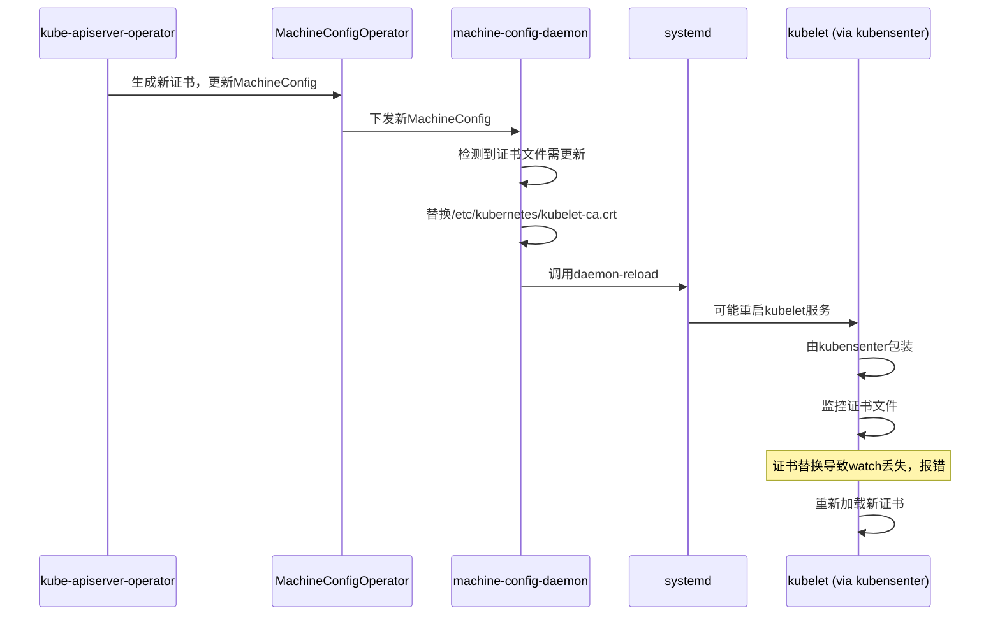

# kube-apiserver证书轮换触发节点服务重启的机制分析

## 背景

- OpenShift集群中，`openshift-kubeapiserver-operator`会定期轮换kube-apiserver相关证书
- 其中，`/etc/kubernetes/kubelet-ca.crt`是kubelet用于验证apiserver客户端证书的CA
- 证书轮换后，MachineConfig会下发新证书，节点上由`machine-config-daemon`（MCD）应用

## 证书替换流程

1. **证书轮换**
   - 证书即将过期，`openshift-kubeapiserver-operator`生成新证书
   - 更新ConfigMap，MachineConfig引用新证书内容

2. **MachineConfig下发**
   - MCD检测到MachineConfig变更
   - 计划更新涉及的文件（包括`/etc/kubernetes/kubelet-ca.crt`）

3. **节点文件替换**
   - MCD将新证书写入节点对应路径
   - 替换过程中，原有证书文件被删除或覆盖

4. **systemd配置reload**
   - 文件变更后，MCD会调用`systemctl daemon-reload`
   - 触发systemd重新加载所有服务配置
   - 日志示例：
     ```
     systemd[1]: Reloading.
     ```

5. **相关服务重启**
   - kubelet.service引用了证书文件
   - systemd检测到配置变更，可能重启kubelet或相关依赖服务
   - 但通常不会触发节点整体重启

## kubenswrapper与kubensenter

- kubelet启动命令为：
  ```
  ExecStart=/usr/local/bin/kubenswrapper /usr/bin/kubelet
  ```
- `kubenswrapper`是兼容性包装器，实际调用`/usr/bin/kubensenter`
- `kubensenter`负责：
  - 进入特定namespace
  - 动态watch证书文件
  - 证书变更时，重新加载CA Bundle

## 报错分析（已脱敏）

- 证书替换期间，`kubensenter`内部watch的`/etc/kubernetes/kubelet-ca.crt`被删除或替换
- 导致inotify watch失效，报错：
  ```
  Failed to remove file watch, it may have been deleted
  can't remove non-existent inotify watch for: /etc/kubernetes/kubelet-ca.crt
  ```
- 随后，`kubensenter`重新加载新证书：
  ```
  Loaded a new CA Bundle and Verifier
  ```

## Mermaid时序图



## 结论

- kube-apiserver证书轮换通过MachineConfig分发至节点
- 证书替换触发systemd配置reload，可能导致kubelet等服务重启
- `kubensenter`动态watch证书，替换期间watch丢失报错，随后自动恢复
- 整个过程无需节点整体重启，保证了平滑升级
