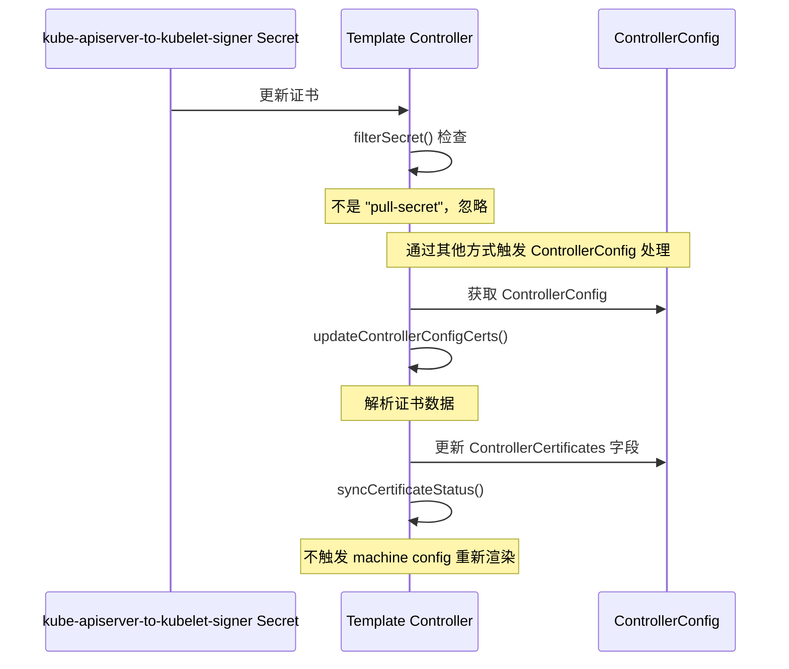
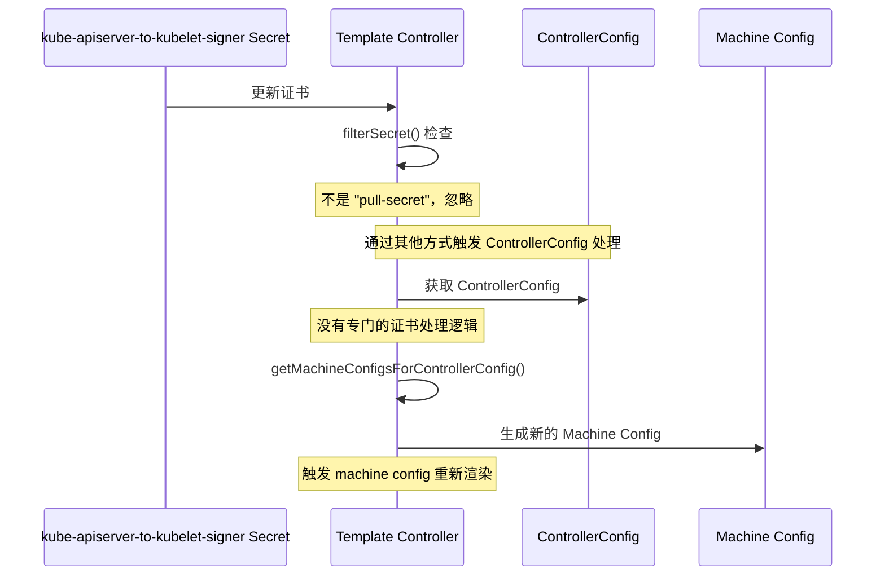

# kube-apiserver-to-kubelet-signer 更新行为差异分析

## 问题概述

在 wzh-4.16 和 wzh-4.12 两个分支中，更新 kube-apiserver-to-kubelet-signer 证书会导致不同的行为：
- wzh-4.16 分支：不会创建新的 render machine config
- wzh-4.12 分支：会创建新的 render machine config

## 核心差异分析

通过对两个分支代码的分析，发现了以下关键差异：

### 1. 证书处理机制的变化

**wzh-4.16 分支**:
- 引入了 `ControllerCertificates` 字段到 `ControllerConfigStatus` 结构体中，用于存储证书信息
- 添加了 `updateControllerConfigCerts` 函数，专门处理证书数据并更新状态
- 在 `syncControllerConfig` 函数中调用 `updateControllerConfigCerts` 处理证书变更

```go
// wzh-4.16 中的 ControllerConfigStatus 结构体
type ControllerConfigStatus struct {
    ObservedGeneration int64 `json:"observedGeneration,omitempty"`
    Conditions []ControllerConfigStatusCondition `json:"conditions"`
    ControllerCertificates []ControllerCertificate `json:"controllerCertificates"`
}

// wzh-4.16 中的 syncControllerConfig 函数片段
modified := updateControllerConfigCerts(cfg)
if modified {
    if err := ctrl.syncCertificateStatus(cfg); err != nil {
        return err
    }
}
```

**wzh-4.12 分支**:
- `ControllerConfigStatus` 结构体中没有 `ControllerCertificates` 字段
- 没有 `updateControllerConfigCerts` 函数
- 没有专门处理证书变更的逻辑

```go
// wzh-4.12 中的 ControllerConfigStatus 结构体
type ControllerConfigStatus struct {
    ObservedGeneration int64 `json:"observedGeneration,omitempty"`
    Conditions []ControllerConfigStatusCondition `json:"conditions"`
}
```

### 2. Secret 监听和处理逻辑

两个分支中，Secret 的监听和处理逻辑基本相同：

```go
// 两个分支中的 filterSecret 函数
func (ctrl *Controller) filterSecret(secret *corev1.Secret) {
    if secret.Name == "pull-secret" {
        ctrl.enqueueController()
        klog.Infof("Re-syncing ControllerConfig due to secret %s change", secret.Name)
    }
}
```

这个函数在两个分支中都只关注 "pull-secret" 这个特定的 Secret，对于其他 Secret（包括 kube-apiserver-to-kubelet-signer）的变更都会被忽略。

## 行为差异原因

1. **wzh-4.16 分支**：
   - 当 kube-apiserver-to-kubelet-signer 证书更新时，由于 `filterSecret` 函数只关注 "pull-secret"，不会触发 ControllerConfig 的重新排队
   - 即使通过其他方式（如 ControllerConfig 更新）触发了处理，`updateControllerConfigCerts` 函数会将证书信息存储在 `ControllerCertificates` 字段中，但不会触发 machine config 的重新渲染

2. **wzh-4.12 分支**：
   - 同样，`filterSecret` 函数不会直接响应 kube-apiserver-to-kubelet-signer 的更新
   - 但是，由于 wzh-4.12 没有专门的证书处理逻辑，当 ControllerConfig 中的 KubeAPIServerServingCAData 字段更新时（这可能通过其他机制触发），会被视为普通的配置变更，从而触发 machine config 的重新渲染

## 时序图对比

### wzh-4.16 分支中的证书处理流程



### wzh-4.12 分支中的证书处理流程



## 结论

1. wzh-4.16 分支引入了专门的证书处理机制，将证书信息存储在 ControllerConfigStatus 的 ControllerCertificates 字段中，但不会因为证书更新而触发 machine config 的重新渲染。

2. wzh-4.12 分支没有专门的证书处理机制，当 ControllerConfig 中的证书数据更新时，会被视为普通的配置变更，从而触发 machine config 的重新渲染。

3. 两个分支中，Secret 的监听逻辑都只关注 "pull-secret"，对于 kube-apiserver-to-kubelet-signer 的直接更新都不会触发处理。但当 ControllerConfig 中的证书数据通过其他方式更新时，处理逻辑的差异导致了不同的行为。
