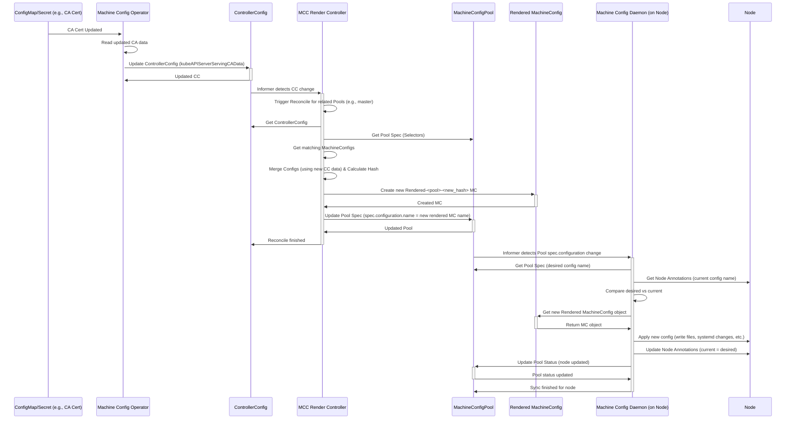

# Machine Config Operator (MCO) 配置渲染与分发详解

## 1. 引言

Machine Config Operator (MCO) 是 OpenShift Container Platform (OCP) 的核心组件之一，负责管理节点的操作系统和集群配置。它通过 `MachineConfig` 对象来定义节点配置，并通过 `MachineConfigPool` 将这些配置应用于特定角色的节点（如 master, worker）。本报告将详细解释 MCO 如何基于 `MachineConfig`、`MachineConfigPool` 和 `ControllerConfig` 生成新的 `rendered` MachineConfig，如何将其分发到节点，以及为什么集群 CA 证书的更新会触发新的配置渲染。

## 2. MachineConfig 渲染过程

MachineConfig 的渲染是一个多阶段的过程，主要由 `machine-config-controller` (MCC) 中的多个控制器协同完成，最终生成一个包含所有必要配置的、不可变的 `rendered-<pool>-<hash>` MachineConfig 对象。

**关键组件:**

*   **MachineConfig (MC):** 定义具体的配置片段，例如文件内容、systemd单元、内核参数等。可以包含 Ignition 配置片段。
*   **MachineConfigPool (MCP):** 定义一组具有相同角色的节点（例如 `master` 或 `worker`），并指定应用于这些节点的最终 `rendered` MachineConfig (`spec.configuration.name`)。MCP 通过标签选择器 (`spec.machineConfigSelector`) 来选择包含哪些 MC。
*   **ControllerConfig (CC):** 包含集群范围内的动态配置信息，这些信息会影响最终渲染的 MachineConfig。例如，它可能包含 API 服务器 URL、集群 CA 证书、镜像拉取密钥等。
*   **Template Controller (`pkg/controller/template`):** 负责处理 MCO 提供的内置配置模板（位于 `templates/` 目录下），并根据集群平台（AWS, GCP, BareMetal 等）和节点角色（master, worker）生成基础的 MachineConfig 对象。
*   **Render Controller (`pkg/controller/render`):** 核心渲染逻辑所在。它监视 `MachineConfigPool`、匹配的 `MachineConfig` 以及 `ControllerConfig` 的变化。当检测到任何相关资源发生变化时，它会触发一次新的渲染过程。

**渲染流程:**

1.  **选择配置:** Render Controller 根据 `MachineConfigPool` 的 `machineConfigSelector` 找到所有需要合并的 `MachineConfig` 对象。
2.  **合并配置:** 将选中的 `MachineConfig` 对象与从 Template Controller 生成的基础配置以及 `ControllerConfig` 中提取的相关配置信息进行合并。合并过程遵循特定的优先级规则，并使用 Ignition 库来处理配置的聚合。
3.  **生成 Rendered Config:** 合并后的配置被用来生成一个新的 `MachineConfig` 对象，其名称格式为 `rendered-<pool_name>-<config_hash>`。这个哈希值是根据所有输入配置（包括 `ControllerConfig` 的相关部分）计算得出的，确保了配置内容的唯一性和不可变性。

**代码示例 (Render Controller - `pkg/controller/render/render_controller.go`):**

```go
// generateRenderedMachineConfig takes a pool object and generates the desired rendered MachineConfig object.
func (ctrl *Controller) generateRenderedMachineConfig(pool *mcfgv1.MachineConfigPool) (*mcfgv1.MachineConfig, error) {
    // ... (获取 ControllerConfig)
    cc, err := ctrl.ccLister.Get(ctrlcommon.ControllerConfigName)
    // ...

    // ... (根据 pool selector 获取 MachineConfigs)
    machineConfigs, err := ctrl.mcLister.List(labels.SelectorFromSet(pool.Spec.MachineConfigSelector.MatchLabels))
    // ...

    // ... (合并配置 - 调用 Ignition 库)
    mergedConfig, err := ctrlcommon.MergeMachineConfigs(machineConfigs, cc)
    // ...

    // ... (创建新的 rendered MachineConfig 对象)
    renderedConfig := &mcfgv1.MachineConfig{
        // ... (设置名称、标签、注解)
        ObjectMeta: metav1.ObjectMeta{
            Name:   ctrlcommon.GetRenderedMachineConfigName(pool.Name, mergedConfig.Version()), // 名称包含哈希
            Labels: mergedLabels,
            Annotations: map[string]string{
                ctrlcommon.GeneratedByControllerVersionAnnotationKey: version.Raw,
            },
            OwnerReferences: []metav1.OwnerReference{
                *metav1.NewControllerRef(pool, mcfgv1.SchemeGroupVersion.WithKind("MachineConfigPool")),
            },
        },
        Spec: mergedConfig.Spec, // 合并后的 Ignition 配置
    }
    // ...
    return renderedConfig, nil
}
```

## 3. ControllerConfig 的作用

`ControllerConfig` (`controllerconfig.machineconfiguration.openshift.io`) 是一个单例的 CRD 对象（通常名为 `machine-config-controller`），它扮演着 MCO 配置渲染过程中动态数据源的角色。它由 `machine-config-operator` (MCO Operator) 负责维护和更新。

**主要作用:**

1.  **提供集群范围的动态数据:** `ControllerConfig` 存储了渲染 MachineConfig 时需要的集群特定信息，这些信息不能硬编码在 `MachineConfig` 或模板中。例如：
    *   Kube API Server 的 URL (`kubeAPIServerServingCAData`, `apiServerURL`)
    *   镜像拉取密钥 (`pullSecret`)
    *   基础 OS 镜像 URL (`osImageURL`)
    *   网络配置 (代理设置等)
    *   平台特定的信息
2.  **触发重新渲染:** 当 `ControllerConfig` 中的任何字段发生变化时（例如，由于其依赖的底层资源如 ConfigMap 或 Secret 更新），Render Controller 会检测到这一变化，并触发对其关联的 `MachineConfigPool` 的重新渲染。这是因为 `ControllerConfig` 的内容是计算 `rendered` MachineConfig 哈希值的输入之一，其变化必然导致哈希值变化，从而需要生成新的 `rendered` 配置。

**代码示例 (Operator 更新 ControllerConfig - `pkg/operator/render.go`):**

```go
// syncRenderConfig reconciles the render config.
func (optr *Operator) syncRenderConfig(config *optrconfig.OperatorConfig) error {
    // ... (获取各种依赖资源，如 CA ConfigMap, Pull Secret等)
    caData, err := optr.fetchKubeAPIServerServingCA()
    // ...
    pullSecretData, err := optr.fetchPullSecret()
    // ...

    // ... (构建 ControllerConfig 对象)
    controllerConfig := &mcfgv1.ControllerConfig{
        // ... (设置名称)
        Spec: mcfgv1.ControllerConfigSpec{
            // ... (填充从依赖资源获取的数据)
            KubeAPIServerServingCAData: caData,
            PullSecret: &corev1.ObjectReference{
                Namespace: "openshift-config",
                Name:      "pull-secret",
            },
            OSImageURL:          config.Images.MachineOSContent,
            // ... 其他字段
        },
    }

    // ... (应用或更新 ControllerConfig 对象到集群)
    _, _, err = resourceapply.ApplyControllerConfig(optr.mcoClient.MachineconfigurationV1(), optr.eventRecorder, controllerConfig)
    return err
}
```

**代码示例 (Render Controller 使用 ControllerConfig - `pkg/controller/render/render_controller.go`):**

```go
// 在 generateRenderedMachineConfig 函数中
cc, err := ctrl.ccLister.Get(ctrlcommon.ControllerConfigName)
if err != nil {
    return nil, fmt.Errorf("could not get ControllerConfig %q: %w", ctrlcommon.ControllerConfigName, err)
}

// ... 调用 MergeMachineConfigs 时传入 cc
mergedConfig, err := ctrlcommon.MergeMachineConfigs(machineConfigs, cc)
```

## 4. 配置分发 (Machine Config Daemon - MCD)

`rendered` MachineConfig 生成后，需要被应用到 `MachineConfigPool` 中的每个节点上。这个任务由 `machine-config-daemon` (MCD) 完成，它以 DaemonSet 的形式运行在每个节点上。

**分发流程:**

1.  **监视 Pool:** MCD 持续监视其所在节点所属的 `MachineConfigPool` 对象。
2.  **检测变更:** 当 MCD 检测到 `MachineConfigPool` 的 `spec.configuration.name` 字段更新为新的 `rendered-<pool>-<hash>` 时，它知道需要应用新的配置。
3.  **获取新配置:** MCD 从 API Server 获取这个新的 `rendered` MachineConfig 对象。
4.  **应用配置:** MCD 解析 `rendered` MachineConfig 中的 Ignition 配置，并将其转化为节点上的实际操作：
    *   写入文件 (`storage.files`)
    *   配置 systemd 单元 (`systemd.units`)
    *   执行其他必要的系统级更改
5.  **更新节点状态:** 配置应用成功后，MCD 会更新节点对象的注解（`machineconfiguration.openshift.io/currentConfig` 和 `machineconfiguration.openshift.io/desiredConfig`）以及 `MachineConfigPool` 的状态 (`status.configuration.name`)，表明该节点已更新到最新的配置。如果需要重启，MCD 会协调节点的重启过程。

**代码示例 (MCD 应用配置 - `pkg/daemon/daemon.go`):**

```go
// Run attempts to sync the node's configuration with the desired machine config
// in the MachineConfigPool.
func (dn *Daemon) Run(stopCh <-chan struct{}, exitCh <-chan error) error {
    // ... (获取当前节点和所属的 Pool)

    // ... (获取 Pool 指定的 desired MachineConfig Name)
    desiredConfigName := pool.Spec.Configuration.Name

    // ... (获取节点当前的 MachineConfig Name)
    currentConfigName := node.Annotations[ctrlcommon.CurrentMachineConfigAnnotationKey]

    if desiredConfigName == currentConfigName {
        // ... (配置已是最新，无需操作)
        return nil
    }

    // ... (获取 desired MachineConfig 对象)
    desiredConfig, err := dn.mcLister.Get(desiredConfigName)
    // ...

    // ... (调用 updateState 应用配置)
    if err := dn.updateState(desiredConfig); err != nil {
        // ... (处理错误)
        return err
    }

    // ... (更新节点注解，标记为已更新到 desiredConfig)
    err = dn.nodeWriter.SetCurrentConfig(node, desiredConfig)
    // ...

    return nil
}

// updateState applies the provided configuration to the node.
func (dn *Daemon) updateState(config *mcfgv1.MachineConfig) error {
    // ... (将 MachineConfig Spec (Ignition) 转换为底层操作)

    // ... (写入文件)
    if err := dn.writeFile(file); err != nil {
        // ...
    }

    // ... (处理 systemd 单元)
    if err := dn.writeUnit(unit); err != nil {
        // ...
    }
    if err := dn.runSystemdCommand("daemon-reload"); err != nil {
        // ...
    }
    // ... (启用/禁用/启动/停止单元)

    // ... (其他配置应用逻辑)

    return nil
}
```

## 5. CA 更新触发重新渲染的原因

集群中的某些 CA 证书（特别是用于保护 Kubernetes API Server 通信的 CA，如 `kube-apiserver-serving-ca`）通常需要分发到所有节点，以便节点上的组件（如 Kubelet）能够安全地与 API Server 通信。MCO 将这些 CA 证书数据包含在最终渲染的 MachineConfig 中。

**触发流程:**

1.  **Operator 监视 CA:** `machine-config-operator` 会监视存储这些 CA 证书的资源，通常是 `openshift-config` 命名空间下的 ConfigMap（例如 `kube-apiserver-serving-ca`）。
2.  **CA 资源更新:** 当这些 ConfigMap 或 Secret 因为证书轮换或其他原因发生更新时，Operator 会检测到变化。
3.  **更新 ControllerConfig:** Operator 读取更新后的 CA 数据，并用它来更新 `ControllerConfig` 对象的相应字段（例如 `spec.kubeAPIServerServingCAData`）。
4.  **Render Controller 触发:** `machine-config-controller` 中的 Render Controller 监视着 `ControllerConfig`。当它检测到 `ControllerConfig` 因为 CA 更新而发生变化时，会触发关联 `MachineConfigPool` 的重新渲染。
5.  **生成新 Rendered MC:** 由于 `ControllerConfig` 的内容（包含新的 CA 数据）是计算 `rendered` MachineConfig 哈希值的输入之一，其变化导致哈希值改变。因此，Render Controller 会生成一个新的 `rendered-<pool>-<new_hash>` MachineConfig 对象，其中包含了更新后的 CA 证书。
6.  **分发新配置:** 后续流程与第 4 节所述一致，新的 `rendered` 配置会被 MCD 检测到并应用到节点上。

**日志分析 (来自 `wzh.evid/mco.log` - 已脱敏):**

日志中可以观察到类似以下的序列（时间戳和具体哈希已脱敏）：

```log
I... [Timestamp] controller.go:XXX] Event(v1.ObjectReference{Kind:"ConfigMap", Namespace:"openshift-kube-apiserver", Name:"kube-apiserver-serving-ca", ...}): ConfigMap openshift-kube-apiserver/kube-apiserver-serving-ca updated
I... [Timestamp] operator.go:XXX] Got updated CA data, syncing render config
I... [Timestamp] render.go:XXX] Syncing ControllerConfig machine-config-controller
I... [Timestamp] resource_apply.go:XXX] controllerconfig "machine-config-controller" updated
I... [Timestamp] render_controller.go:XXX] Pool master: ControllerConfig machine-config-controller changed, reconciling
I... [Timestamp] render_controller.go:XXX] Pool master: Generating rendered config rendered-master-[old_hash] -> rendered-master-[new_hash]
I... [Timestamp] resource_apply.go:XXX] machineconfig "rendered-master-[new_hash]" created
I... [Timestamp] render_controller.go:XXX] Pool master: Updated pool to rendered-master-[new_hash]
I... [Timestamp] machineconfigpool_controller.go:XXX] Pool master: Finished syncing
```

这个日志序列清晰地展示了 `kube-apiserver-serving-ca` ConfigMap 的更新如何触发 Operator 更新 `ControllerConfig`，进而导致 Render Controller 生成新的 `rendered-master-` 配置，并更新 `master` Pool 指向这个新配置。

## 6. Mermaid 时序图



## 7. 结论

MCO 通过 `MachineConfig`、`MachineConfigPool` 和 `ControllerConfig` 的协同工作，实现了对 OpenShift 节点配置的声明式管理。`ControllerConfig` 作为动态配置的载体，使得集群范围的变化（如 CA 证书更新）能够自动触发配置的重新渲染和分发。Render Controller 负责合并配置并生成包含内容哈希的 `rendered` MachineConfig，确保了配置的幂等性和可追溯性。最后，Machine Config Daemon 在每个节点上运行，负责将最新的 `rendered` 配置应用到本地，完成整个配置管理的闭环。理解这个流程对于排查节点配置问题和管理集群至关重要。
