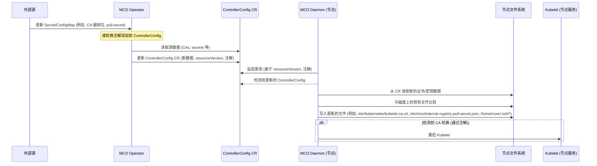

# OpenShift Machine Config Operator 证书/密钥轮换逻辑

本文档概述了 Machine Config Operator (MCO) 及其相关组件（如 Machine Config Daemon - MCD）用于处理证书、密钥和秘钥轮换并将其分发到 OpenShift 节点的逻辑（基于对 4.16 版本代码库的分析）。

## 概述

MCO 通常不*生成*新的证书或密钥（这通常由其他 OpenShift 组件处理，如 `service-ca-operator`、`ingress-operator` 或管理员手动操作）。相反，MCO/MCD 系统负责：

1.  **检测**包含相关数据（例如，CA 捆绑包、拉取密钥、云提供商配置）的源 ConfigMap 和 Secret 的更改。
2.  通过 `ControllerConfig` 自定义资源将这些更改**传播**到节点。
3.  通过将文件写入节点文件系统上的正确位置，在每个节点上**应用**这些更改。
4.  如果更改需要（例如，重大的 CA 更新），则**重启**相关服务（如 `kubelet`）。

## 关键组件和逻辑流程

该过程涉及两个主要参与者：集中运行的 MCO Operator 和在每个节点上作为 DaemonSet 运行的 MCD。

### 1. MCO Operator (`pkg/operator/sync.go`)

*   Operator 作为中央部署运行。
*   它监视集群中的各种源 ConfigMap 和 Secret，主要在 `openshift-config` 和 `openshift-config-managed` 命名空间中。示例包括：
    *   `pull-secret` (Secret)
    *   `kube-cloud-config` (用于云提供商详细信息的 ConfigMap)
    *   CA 捆绑包 (例如, `*-ca-bundle` ConfigMaps)
    *   与 MCO 服务帐户关联的镜像仓库拉取密钥。
*   当在这些源中检测到更改时，Operator 会获取相关数据。
*   它在必要时合并数据（例如，合并多个 CA 捆绑包，将镜像仓库拉取密钥与全局拉取密钥合并）。
*   它使用最新的合并数据更新中央 `ControllerConfig` 自定义资源 (`machineconfiguration.openshift.io`)。此更新会更改 `ControllerConfig` 的 `resourceVersion`。
*   它还可能更新 `ControllerConfig` 上的注解，例如 `service-ca.machineconfiguration.openshift.io/rotate`，以指示守护进程需要执行的特定操作。

**相关源代码片段:**

*   `pkg/operator/sync.go`: 包含主同步循环 (`sync`)，以及用于获取 CA (`getCAsFromConfigMap`)、云配置 (`getCloudConfigFromConfigMap`) 和合并拉取密钥 (`getImageRegistryPullSecrets`) 的函数。

### 2. MCO Daemon (`pkg/daemon/certificate_writer.go`, `pkg/daemon/update.go`)

*   Daemon 在每个由 machineconfig 管理的节点上运行。
*   它监视 `ControllerConfig` 自定义资源。
*   当它检测到 `ControllerConfig` 中的更改时（通过比较它上次处理的 `metadata.resourceVersion`（存储在 Node 对象的注解中）与当前版本），它会触发同步。
*   **证书处理 (`pkg/daemon/certificate_writer.go`):**
    *   `syncControllerConfigHandler` 函数专门处理从 `ControllerConfig` 派生的证书更新。
    *   它从 `ControllerConfig` 读取 CA 数据（如 kubelet CA）。
    *   它将接收到的 CA 与当前存在于 `/etc/kubernetes/kubelet-ca.crt` 中的 CA 进行比较。
    *   如果发现差异，它会将新的捆绑包写入 `/etc/kubernetes/kubelet-ca.crt`。
    *   如果检测到 `service-ca.machineconfiguration.openshift.io/rotate: "true"` 注解并且 CA 已更改，它会触发 `kubelet` 重启 (`systemctl stop kubelet`)。
    *   它还处理合并内部镜像仓库拉取密钥并将其写入 `/etc/mco/internal-registry-pull-secret.json`。
*   **通用文件/更新处理 (`pkg/daemon/update.go`):**
    *   主节点同步循环 (`syncNode`) 将期望的配置（从 `ControllerConfig` 派生）与当前节点状态进行比较。
    *   `updateFiles` 函数处理写入 MachineConfig 中定义的通用文件，包括 SSH 密钥 (`/home/core/.ssh/authorized_keys` 或 `/home/core/.ssh/authorized_keys.d/ignition`)。对 SSH 密钥或主拉取密钥 (`/var/lib/kubelet/config.json`) 的更改通常被视为 `postConfigChangeActionNone`，这意味着它们通常不需要重启或驱逐节点，只需更新文件。

**相关源代码片段:**

*   `pkg/daemon/certificate_writer.go`: 包含 `syncControllerConfigHandler`，写入 `kubelet-ca.crt` 的逻辑，处理服务 CA 轮换注解，以及写入内部仓库拉取密钥。包括 `mergeMountedSecretsWithControllerConfig` 等函数。
*   `pkg/daemon/update.go`: 包含 `syncNode`、`updateFiles` 以及处理 SSH 密钥更新 (`updateSSHKeys`, `cleanSSHKeyPaths`) 的逻辑。定义了 `caBundleFilePath` 和 `postConfigChangeActionNone` 等常量。

## 结论

MCO 系统提供了一个强大的机制，用于将更新的证书和密钥分发到节点。Operator 集中收集数据并将其合并到 `ControllerConfig` CR 中，而每个节点上的 Daemon 则确保这些更改在本地应用于文件系统，并根据注解等特定信号触发必要的服务重启。这种分离允许在集群节点之间实现一致的配置。
