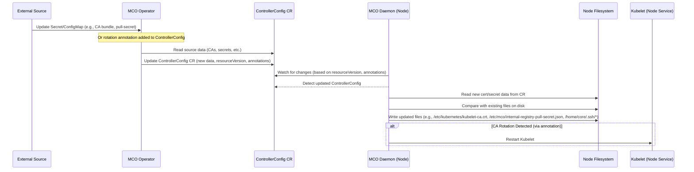

# OpenShift Machine Config Operator Certificate/Secret Rotation Logic

This document outlines the logic used by the Machine Config Operator (MCO) and its associated components (like the Machine Config Daemon - MCD) to handle the rotation and distribution of certificates, secrets, and keys to OpenShift nodes as of version 4.16 (based on the analyzed codebase).

## Overview

The MCO doesn't typically *generate* new certificates or secrets itself (this is often handled by other OpenShift components like `service-ca-operator`, `ingress-operator`, or manual admin actions). Instead, the MCO/MCD system is responsible for:

1.  **Detecting** changes in source ConfigMaps and Secrets that contain relevant data (e.g., CA bundles, pull secrets, cloud provider configs).
2.  **Propagating** these changes to the nodes via the `ControllerConfig` custom resource.
3.  **Applying** these changes on each node by writing files to the correct locations on the node's filesystem.
4.  **Restarting** relevant services (like `kubelet`) if a change necessitates it (e.g., a significant CA update).

## Key Components and Logic Flow

The process involves two main actors: the MCO Operator running centrally and the MCD running as a DaemonSet on each node.

### 1. MCO Operator (`pkg/operator/sync.go`)

*   The operator runs as a central deployment.
*   It watches various source ConfigMaps and Secrets across the cluster, primarily in the `openshift-config` and `openshift-config-managed` namespaces. Examples include:
    *   `pull-secret` (Secret)
    *   `kube-cloud-config` (ConfigMap for cloud provider details)
    *   CA bundles (e.g., `*-ca-bundle` ConfigMaps)
    *   Image registry pull secrets associated with the MCO service account.
*   When changes are detected in these sources, the operator fetches the relevant data.
*   It merges data where necessary (e.g., combining multiple CA bundles, merging image registry pull secrets with the global pull secret).
*   It updates the central `ControllerConfig` custom resource (`machineconfiguration.openshift.io`) with the latest consolidated data. This update changes the `resourceVersion` of the `ControllerConfig`.
*   It may also update annotations on the `ControllerConfig`, such as `service-ca.machineconfiguration.openshift.io/rotate`, to signal specific actions needed by the daemon.

**Relevant Source Code Snippets:**

*   `pkg/operator/sync.go`: Contains the main sync loop (`sync`), functions to fetch CAs (`getCAsFromConfigMap`), cloud config (`getCloudConfigFromConfigMap`), and merge pull secrets (`getImageRegistryPullSecrets`).

### 2. MCO Daemon (`pkg/daemon/certificate_writer.go`, `pkg/daemon/update.go`)

*   The daemon runs on every machineconfig-managed node.
*   It watches the `ControllerConfig` custom resource.
*   When it detects a change in the `ControllerConfig` (by comparing the `metadata.resourceVersion` it last processed, stored in an annotation on the Node object, with the current version), it triggers a sync.
*   **Certificate Handling (`pkg/daemon/certificate_writer.go`):**
    *   The `syncControllerConfigHandler` function specifically handles certificate updates derived from the `ControllerConfig`.
    *   It reads CA data (like the kubelet CA) from the `ControllerConfig`.
    *   It compares the received CAs with the ones currently present in `/etc/kubernetes/kubelet-ca.crt`.
    *   If differences are found, it writes the new bundle to `/etc/kubernetes/kubelet-ca.crt`.
    *   If the `service-ca.machineconfiguration.openshift.io/rotate: "true"` annotation is detected and CAs have changed, it triggers a `kubelet` restart (`systemctl stop kubelet`).
    *   It also handles merging and writing the internal image registry pull secret to `/etc/mco/internal-registry-pull-secret.json`.
*   **General File/Update Handling (`pkg/daemon/update.go`):**
    *   The main node sync loop (`syncNode`) compares the desired config (derived from `ControllerConfig`) with the current node state.
    *   The `updateFiles` function handles writing general files defined in the MachineConfig, including SSH keys (`/home/core/.ssh/authorized_keys` or `/home/core/.ssh/authorized_keys.d/ignition`). Changes to SSH keys or the main pull secret (`/var/lib/kubelet/config.json`) are often treated as `postConfigChangeActionNone`, meaning they don't typically require a reboot or drain, just file updates.

**Relevant Source Code Snippets:**

*   `pkg/daemon/certificate_writer.go`: Contains `syncControllerConfigHandler`, logic for writing `kubelet-ca.crt`, handling the service CA rotation annotation, and writing the internal registry pull secret. Includes functions like `mergeMountedSecretsWithControllerConfig`.
*   `pkg/daemon/update.go`: Contains `syncNode`, `updateFiles`, and logic for handling SSH key updates (`updateSSHKeys`, `cleanSSHKeyPaths`). Defines constants like `caBundleFilePath` and `postConfigChangeActionNone`.

## Conclusion

The MCO system provides a robust mechanism for distributing updated certificates and secrets to nodes. The operator centralizes the gathering and merging of data into the `ControllerConfig` CR, while the daemon on each node ensures these changes are applied locally to the filesystem and triggers necessary service restarts based on specific signals like annotations. This separation allows for consistent configuration across the cluster nodes.
