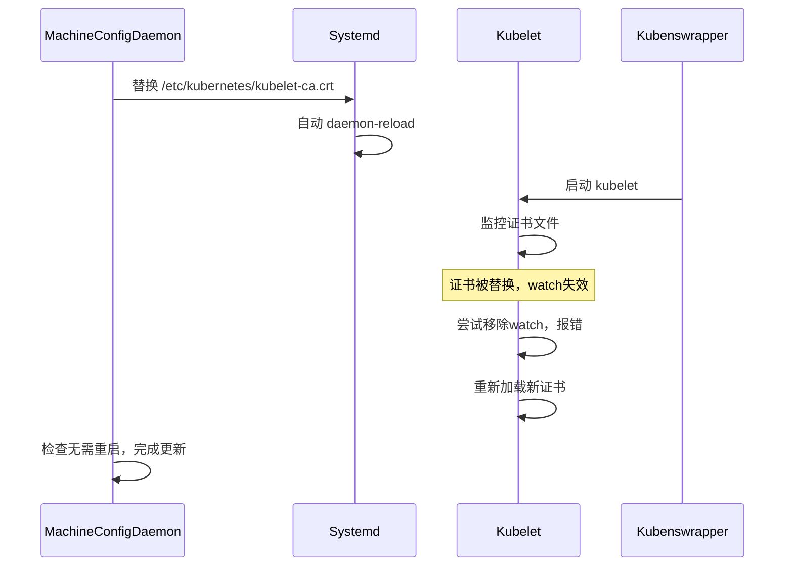

# kube-apiserver证书更新触发systemd重载及kubenswrapper报错分析

## 背景
在OpenShift集群中，`/etc/kubernetes/kubelet-ca.crt`是kubelet用于客户端认证的CA证书，由`openshift-kubeapiserver-operator`自动轮换。

一次证书更新过程中，日志显示：
- 证书文件被替换
- systemd多次Reload
- kubenswrapper相关进程报错
- machine-config-daemon未触发节点重启

本文基于源代码，梳理证书更新的完整链路。

---

## 证书更新流程

### 1. 证书文件的分发与替换

- 证书文件路径：
  ```
  /etc/kubernetes/kubelet-ca.crt
  ```
- 由MachineConfig管理，更新时会替换该文件

代码引用：
```go
// pkg/daemon/update.go
filesPostConfigChangeActionNone := []string{
    "/etc/kubernetes/kubelet-ca.crt",
    "/var/lib/kubelet/config.json",
}
```
- **只更新该证书不会触发节点重启**

---

### 2. MachineConfigDaemon应用配置

- 识别变更内容，决定动作
- 只涉及`kubelet-ca.crt`时，动作为`none`，无需重启
- 代码引用：
```go
func calculatePostConfigChangeActionFromFileDiffs(diffFileSet []string) (actions []string) {
    ...
    if ctrlcommon.InSlice(path, filesPostConfigChangeActionNone) {
        continue
    }
    ...
}
```
- **证书替换后，MachineConfigDaemon不会重启节点，也不会reload crio**

---

### 3. systemd自动触发daemon-reload

- 证书文件替换后，systemd检测到配置变更
- 自动执行多次`systemctl daemon-reload`
- 日志：
```
systemd[1]: Reloading.
```
- **此为systemd的自动行为，非MachineConfigDaemon显式调用**

---

## kubenswrapper与kubelet的关系

- `kubenswrapper`是兼容升级的包装脚本
- 内容：
```sh
#!/bin/sh
if [ -x /usr/bin/kubensenter ]; then
  exec /usr/bin/kubensenter "$@"
else
  exec "$@"
fi
```
- 实际运行的是`kubensenter`或`kubelet`

---

## kubelet动态加载证书的机制

- kubelet使用`k8s.io/apiserver/pkg/server/dynamiccertificates`包
- 监控证书文件，动态加载
- 关键逻辑：
  - 使用`fsnotify`监控证书文件
  - 文件被替换时，旧watch失效
  - 尝试移除watch时报错：
    ```
    "Failed to remove file watch, it may have been deleted"
    ```
  - 随后重新加载新证书：
    ```
    "Loaded a new CA Bundle and Verifier"
    ```
- 代码片段（[kubernetes源码](https://github.com/kubernetes/apiserver/blob/master/pkg/server/dynamiccertificates/dynamic_cafile_content.go)）：
```go
func (c *dynamicFileCAContent) watchFile() {
    ...
    watcher.Remove(file) // 文件不存在时报错
    ...
    watcher.Add(file)    // 重新添加watch
    ...
}
```
- **报错是预期内的，非致命**

---

## Mermaid时序图



---

## 结论

- **证书更新时，MachineConfigDaemon替换证书文件，不会触发节点重启**
- **systemd自动检测文件变更，执行daemon-reload**
- **kubelet动态监控证书，替换时watch失效，报错后重新加载新证书**
- **kubenswrapper只是包装脚本，报错来自kubelet内部**

---

## 参考

- MachineConfigDaemon源码 `pkg/daemon/update.go`
- kubenswrapper脚本 `templates/master/01-master-kubelet/_base/files/kubenswrapper.yaml`
- Kubernetes源码 [dynamic_cafile_content.go](https://github.com/kubernetes/apiserver/blob/master/pkg/server/dynamiccertificates/dynamic_cafile_content.go)
- 日志（脱敏）：
  ```
  "Failed to remove file watch, it may have been deleted"
  "Loaded a new CA Bundle and Verifier"
